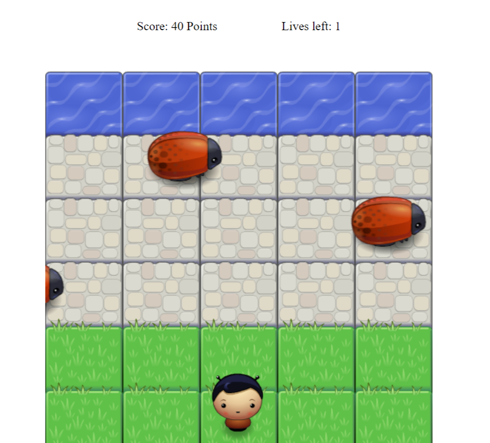

# Udacity Classic Arcade Game 

The goal of the game is to move the character to the water using the arrow keys without colliding into any of the enemies. The enemies move in varying speeds on the paved block portion of the scene. If the character collides with an enemy, the game is reset and the character is moved back to the starting square. When the character reached the water, the player won with 10 points and the character is also moved back to the beginning.

Play the Game Here https://turkialmalki.github.io/Arcade-Game/

